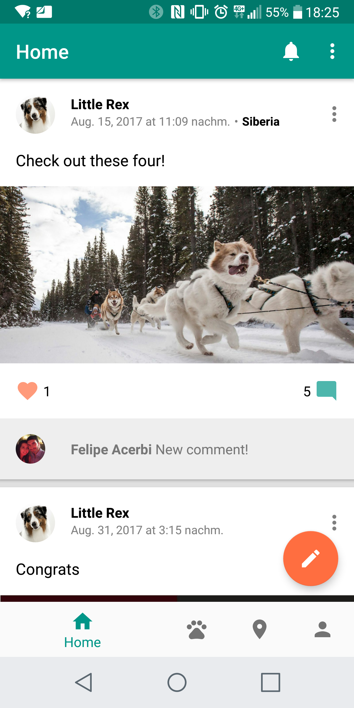
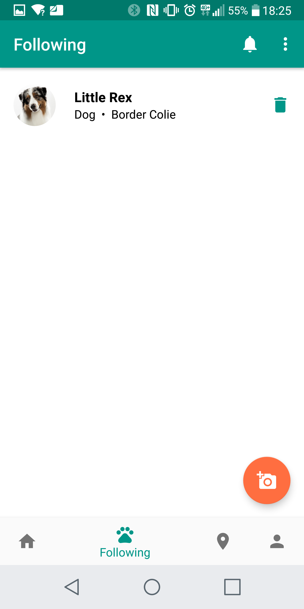
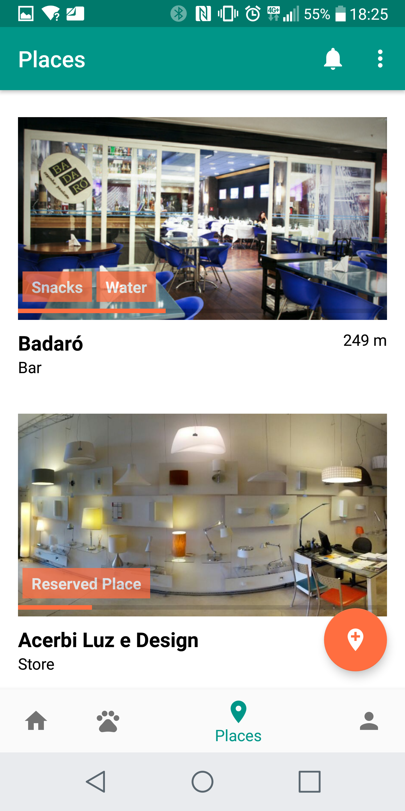
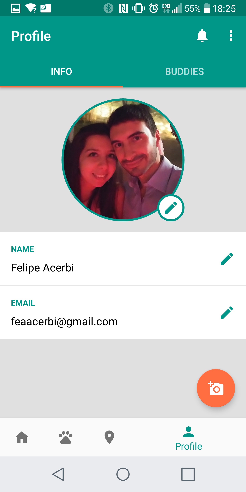
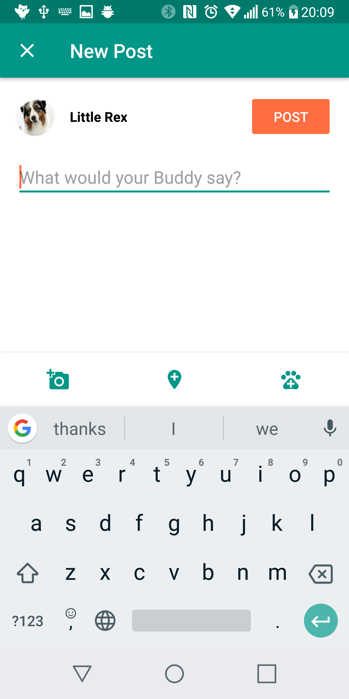
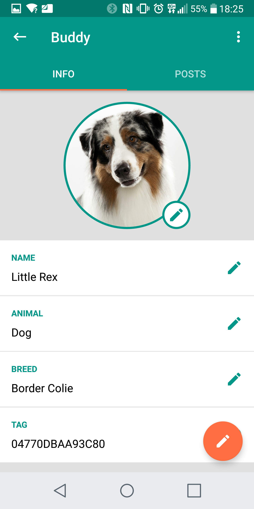
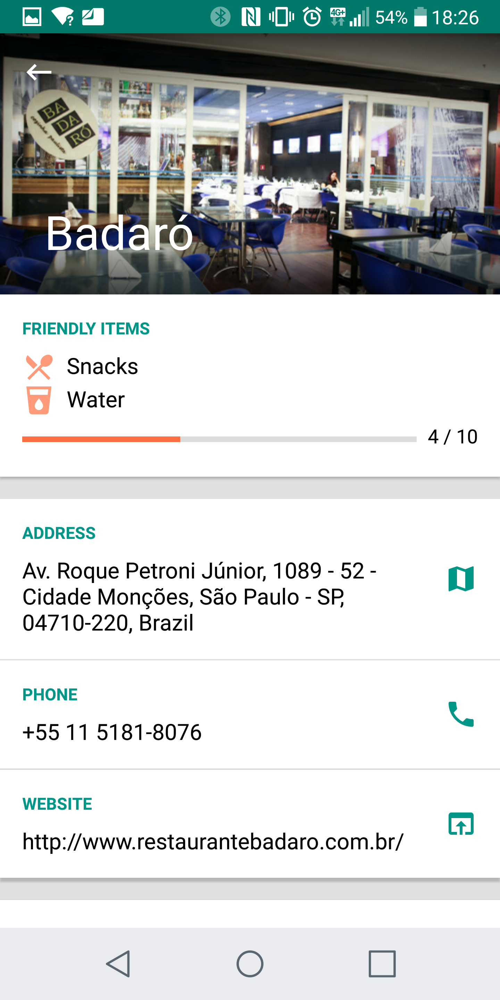
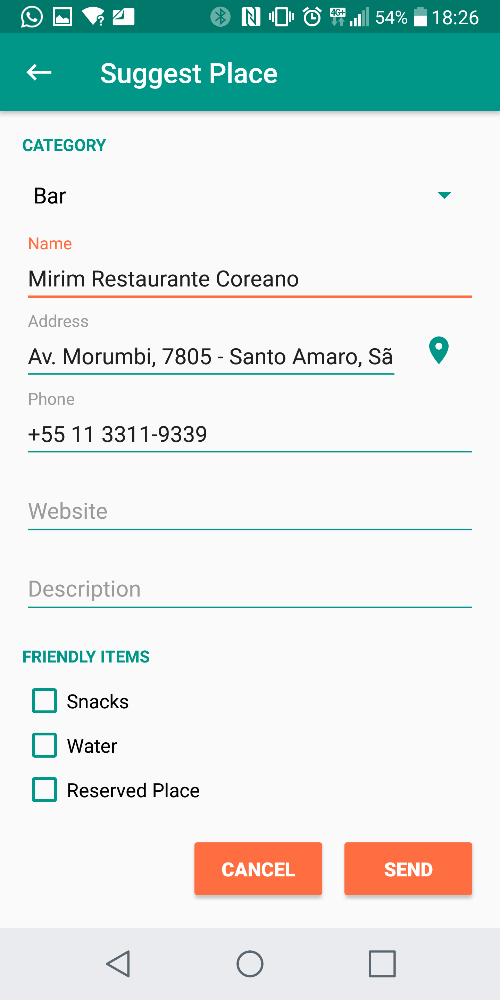
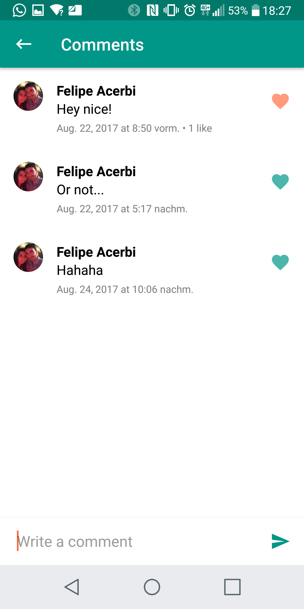
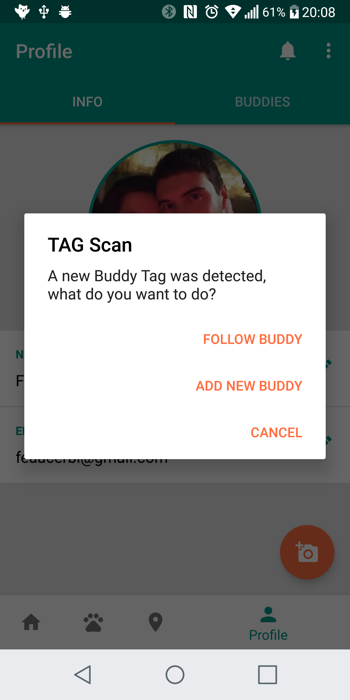

# Buddies
This project is basically a social network for pets.
It`s designed to scan NFC and QR code tags, so that the animal can wear a necklace with its own identifier. This way, people can add them with the app and follow their posts, activities and photos.
Also, it`s possible to check the nearest places that are pet friendly and know what they have to offer.

Obs: The app code is all in Kotlin.

## Screenshots from the app so far

